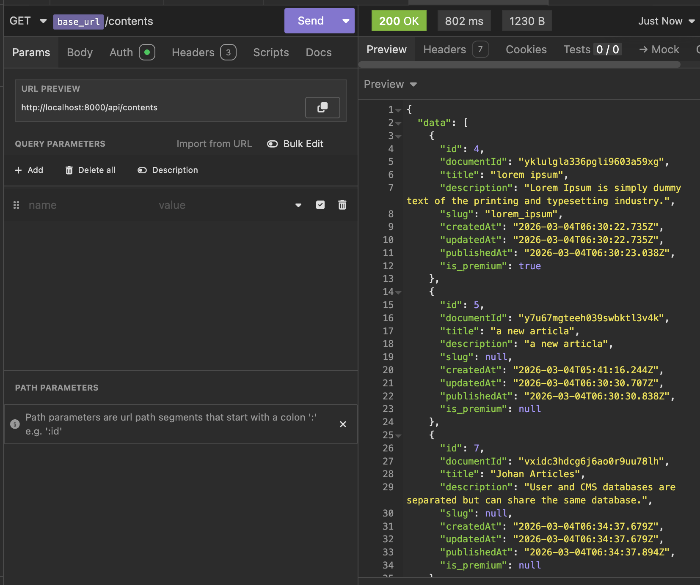

# Requirement for Assignment Interview

## Importing API Requests

To test or explore the API endpoints, you can import the provided API request collection:

- The file is named: **Insomnia_2026-03-05.har**
- This file can be imported into **Postman** or **Insomnia** to quickly load all pre-configured API requests.
- Once imported, you can run requests, view example responses, and test authentication flows.

> 💡 Note: Ensure you have the necessary API keys or credentials configured after import.

## Setup Instructions

## Prerequisites
- PHP: 8.5.x
- Laravel: 12
- Docker & Docker Compose
- Composer

---

Run the following command to start the development environment:
## 1. Start Docker Containers

Inside your project directory, run:
```bash
docker-compose up -d
```

## 2. Install PHP Dependencies
Inside your project directory, run:

```bash
composer install
```

## 3.Configure Environment Variables
Create or update the .env file with the following keys:

- Note: Generate APP_KEY using the command:
```php artisan key:generate```
```env
# Application
APP_KEY=generate_app_key
APP_DEBUG=true

# Database
DB_CONNECTION=pgsql
DB_HOST=127.0.0.1
DB_PORT=5432
DB_DATABASE=convergence_db
DB_USERNAME=app_user
DB_PASSWORD=app_password

# Redis
REDIS_CLIENT=phpredis
REDIS_HOST=127.0.0.1
REDIS_PASSWORD=null
REDIS_PORT=6379

# Queue & Cache
QUEUE_CONNECTION=redis
CACHE_STORE=redis

# Strapi CMS
STRAPI_URL=https://amazing-art-61fcfda17b.strapiapp.com/api/
STRAPI_API_KEY=your_api_key_in_txt_file
```
## 4.Run Migrations
Migrate the database tables:
```
php artisan migrate
```

## 5. Test Redis Connection
Note: Make sure you already install **phpredis**

Open Tinker to verify Redis connection:
```
php artisan tinker
```
Then in tinker
```
use Illuminate\Support\Facades\Redis;

Redis::ping(); // should return "PONG"
```

## 6.Run the Application
Start the laravel server
```
php artisan serve
```
Your application should now be running locally and ready to connect to the Strapi CMS for content.

## Architecture Overview

It is designed for high-read traffic, headless CMS Integration, and subscription-based access control.  

### **1. Components**

- **Laravel API**  
  - Handles authentication, subscription validation, and simple business logic.  
  - Provides endpoints for listing and fetching content.
  - Integrates with headless CMS (Strapi) for content retrieval.
  
- **Strapi Headless CMS**  
  - Stores all content: articles, videos, and metadata.  
  - Exposes REST API for the Laravel backend to consume.  
  - Allows content editors to manage and publish content without touching backend code in strapi.  

- **Redis Cache**  
  - Caches Strapi API responses to reduce repeated API calls.  
  - Enhances performance for high-read endpoints like article listings.  

- **Database (PostgreSQL)**  
  - Stores user accounts, subscriptions.  
  - Ensures unique constraints on user email.  

- **Authentication & Subscription**  
  - Uses Laravel Sanctum for token-based authentication.  
  - Middleware validates user subscription before granting access to premium content.  

---

## Trade-offs & Design Decisions

### **1. Laravel vs Node.js vs Go**
- **Laravel** chosen for rapid development, built-in authentication, and strong community support.  
- **Node.js** or **Go** could provide higher throughput for extreme-scale scenarios, but would require more setup for auth, validation, and caching to finish in 5 days.  

### **2. Monolith vs Modular Monolith vs Microservices**
- **Modular Monolith** selected:  
  - Keeps code in a single project for simplicity.  
  - Modules separate responsibilities: authentication, subscription, content integration.  
  - Can be refactored into microservices later if traffic or team grows.  

### **3. Caching & High Traffic**
- Redis used for caching Strapi content.  
- Trade-off: stale data for a few minutes is acceptable to reduce API load.  
- Could implement cache invalidation hooks in Strapi for real-time updates if needed.  

### **4. Subscription Handling**
- Subscription checks are done on-demand, querying the database for active subscriptions.  
- Default subscription created on registration (expires next day) for testing/demo purposes.  

### **5. Headless CMS Integration**
For the current prototype and testing purposes, Strapi is deployed on a **cloud instance with its own separate database (SQLite)**. This allows external testers and stakeholders to access the CMS. As a result:

- Laravel does not store articles or videos locally. All content is **retrieved via API calls to the Strapi instance**.  
- Network latency or timeouts may occur during API calls since Strapi uses a separate database instance from Laravel.  
- Enables multi-client support (mobile apps, web apps, dashboards) without duplicating content storage.  

In a production scenario, both applications could either **share a single database instance** or continue to operate with separate databases, depending on operational and scalability requirements. This setup is temporary for testing, but the **overall design supports one database instance** serving both applications if needed.


---

## Answers to Leadership / Judgment Questions

### 1. What would you build first in the first 30 days?
- Implement **user authentication and subscription logic**.  
- Integrate **Strapi headless CMS** for content retrieval.  
- Implement **Redis caching** for content endpoints.  
- Set up basic API endpoints for listing and fetching content. 
- Error Logger Handler for better debug on production 

### 2. What would you not build yet — and why?
- **Advanced personalization algorithms** or recommendation engines.  
  - Premature optimization; MVP should focus on core functionality.  
- **Microservices split** at this stage.  
  - Modular monolith is sufficient; splitting early increases complexity.  
- **Complex analytics dashboards**.  
  - Can be added later once content and subscription flow is stable.  

### 3. Top 3 Technical Risks
1. **Strapi downtime or slow responses** → mitigated via Redis caching and timeouts.  
2. **High concurrent traffic** → mitigated using caching and database indexing.  
3. **Subscription validation errors** → mitigated by database constraints and middleware checks.  

### 4. How would you onboard a junior developer?
- Provide **high-level architecture overview** and explanation of key modules.  
- Walk through **user registration, subscription, and Strapi integration**.  
- Give access to **Postman collection** to test API endpoints.  
- Assign small, self-contained tasks to familiarize with Laravel, Guzzle, and Redis.  

### 5. How would you ensure quality while moving fast?
- Use **Redis caching** to offload repeated API calls.  
- Wrap critical operations in **database transactions** to prevent partial writes.  
- Implement **automated validation and exception handling** for predictable API responses.  
- Maintain **modular code structure** to allow safe refactoring.  
- Use **Postman or automated tests** to validate all endpoints.  

---

### Example Response List Content Strapi API
This API will call to Strapi API and will cache the response for 30s
